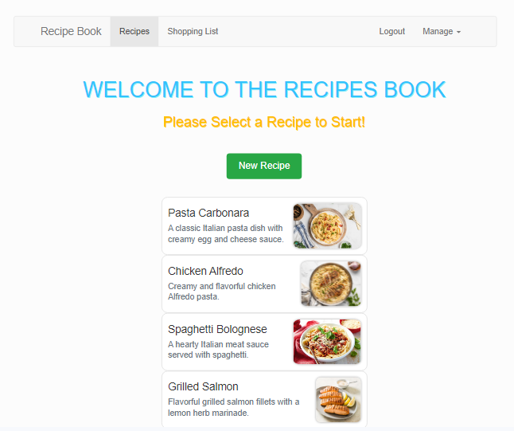

# Angular Recipe Book App :

# Get Started:

[Recipe Book App](https://recipes-angular-app.netlify.app) is a SPA that allows users to browse recipes and manage a shopping list. The project has a [Firebase](https://firebase.google.com/) backend which is used to allow users to create accounts and sign in with their credentials. Authenticated users can then edit recipes, plus save and fetch data from the Firebase endpoint.
To get started, you can use the admin user [admin@admin.com]() with password: **admin123**. Then be sure to Fetch Data from the Manage button at the top right corner of the page. This will load the user's recipes to be managed. From there you can build and manage an overall shopping list.

# Live Demo:

Link: https://recipes-angular-app.netlify.app

# Install

- Clone the repository:

git clone https://github.com/ahmed-aouinti/Angular-Recipe-App.git

# Used libraries

- TypeScript
- Bootstrap5
- Angular
- authentication & route protection;
- HTTP request handling
- services & dependency injection
- routing
- observables
- forms (both template-driven and reactive)
- directives, components & databinding
- Firebase
- Recipe-website

# PrjStart

This project was generated with [Angular CLI](https://github.com/angular/angular-cli) version 15.2.5.

## Development server

Run `ng serve` for a dev server. Navigate to `http://localhost:4200/`. The application will automatically reload if you change any of the source files.

## Code scaffolding

Run `ng generate component component-name` to generate a new component. You can also use `ng generate directive|pipe|service|class|guard|interface|enum|module`.

## Build

Run `ng build` to build the project. The build artifacts will be stored in the `dist/` directory.

## Running unit tests

Run `ng test` to execute the unit tests via [Karma](https://karma-runner.github.io).

## Running end-to-end tests

Run `ng e2e` to execute the end-to-end tests via a platform of your choice. To use this command, you need to first add a package that implements end-to-end testing capabilities.

## Further help

To get more help on the Angular CLI use `ng help` or go check out the [Angular CLI Overview and Command Reference](https://angular.io/cli) page.
